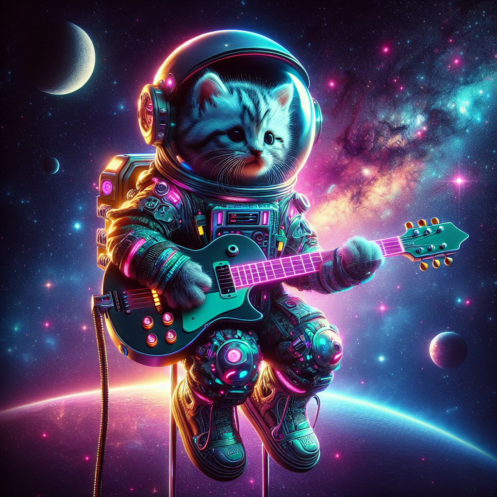

# Creative Image Generation Results

## Original Prompt
"an astronaut kitten playing the guitar while floating in space"

## Output Folder
`examples/outputs/creative_image_pipeline/astronaut_kitten_guitar_space/`

## Base Image Analysis
This is a whimsical and highly detailed digital artwork depicting an adorable kitten astronaut floating in space. The central figure is a small tabby kitten with distinctive brown and cream striped markings, bright blue eyes, and a pink tongue playfully sticking out. The kitten is wearing a complete white space suit with red trim details and a clear, reflective helmet that perfectly frames its cute face.

What makes this image particularly charming is that the astronaut kitten is holding and appearing to play a classical acoustic guitar with an orange-brown wooden body and traditional sound hole. The kitten's paws are positioned as if strumming or playing the instrument.

The cosmic background is breathtaking, featuring a rich tapestry of deep space with countless twinkling stars in various colors - predominantly warm oranges and cool blues. There's a stunning nebula or galaxy visible in the upper right portion of the image, displaying beautiful swirls of orange, pink, and blue cosmic dust and gas. 

In the lower portion of the image, we can see what appears to be a planet's surface covered in fluffy, cloud-like formations in blue and white tones. To the left side, there's another celestial body - likely a moon or planet - visible in the distance.

The overall composition creates a magical, dreamlike quality that combines the wonder of space exploration with the universal appeal of a cute kitten, all while adding the unexpected element of musical performance in zero gravity.

## Style Variations Generated
- photorealistic style
- impressionist style
- cyberpunk style

## Enhanced Prompt
- Original: "an astronaut kitten playing the guitar while floating in space"
- Enhanced: "an astronaut kitten playing the guitar while floating in space"

## Generated Images

| Image | Description |
|-------|-------------|
|  | Original prompt rendering |
|  | Photorealistic style variation |
|  | Impressionist style variation |
|  | Cyberpunk style variation |
|  | AI-enhanced prompt rendering |

**Total images generated:** 5
