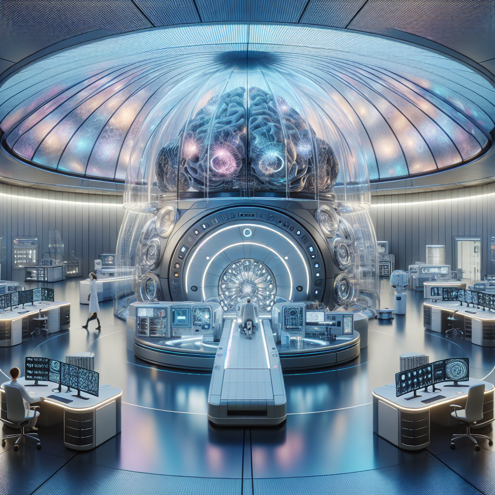
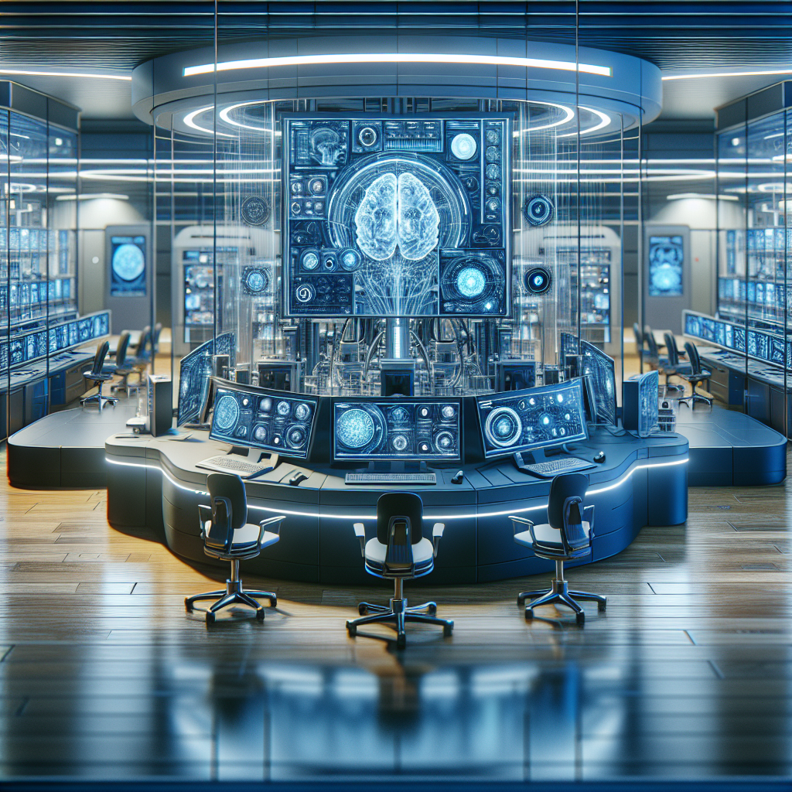
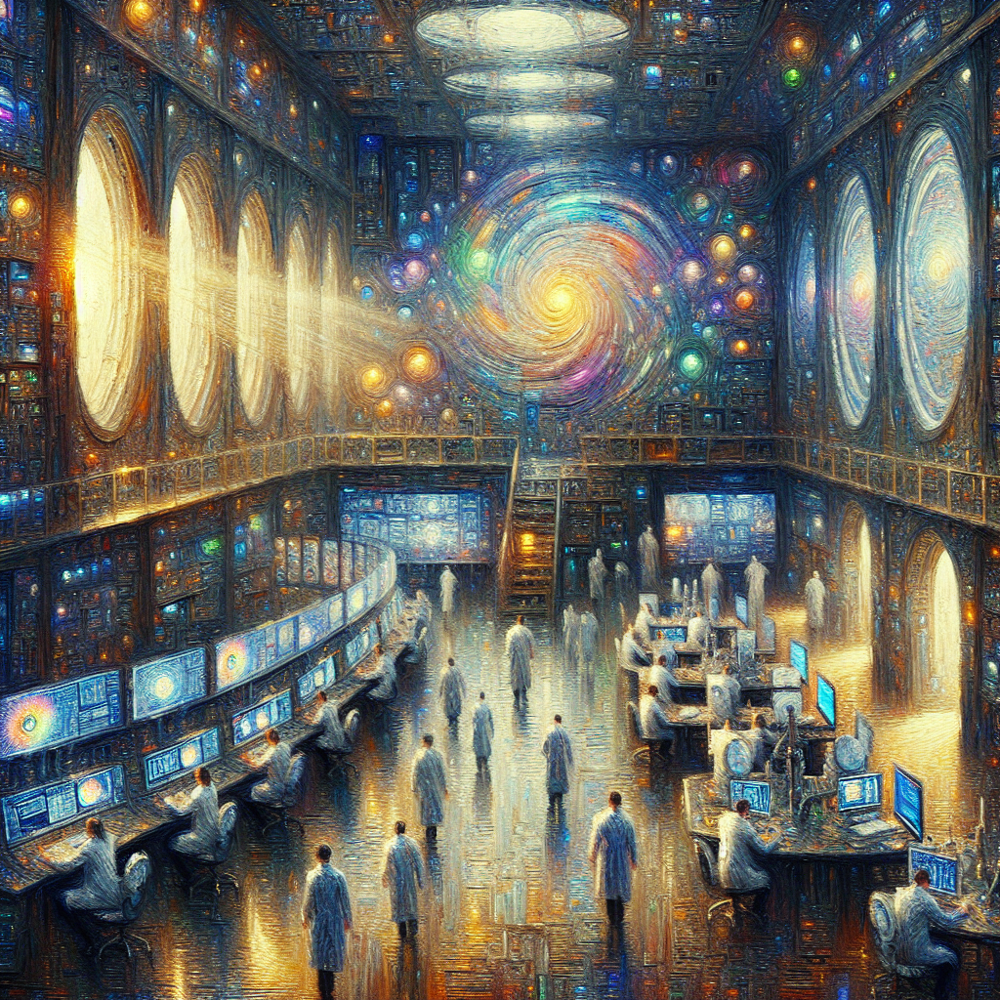
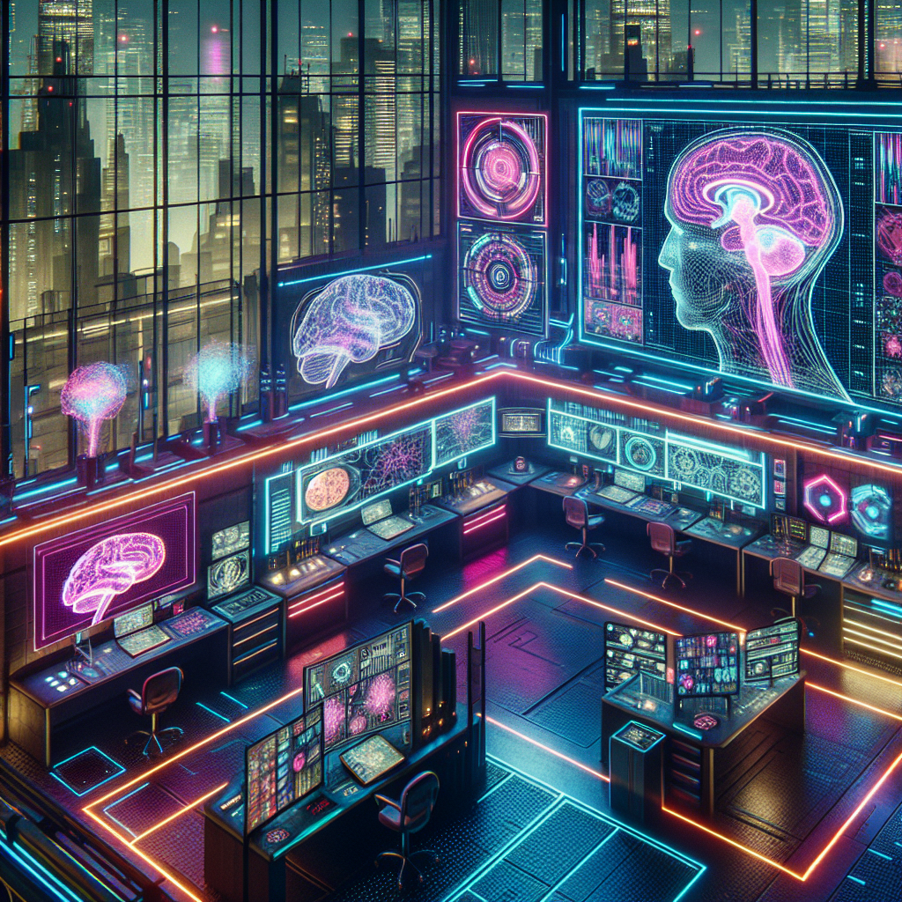
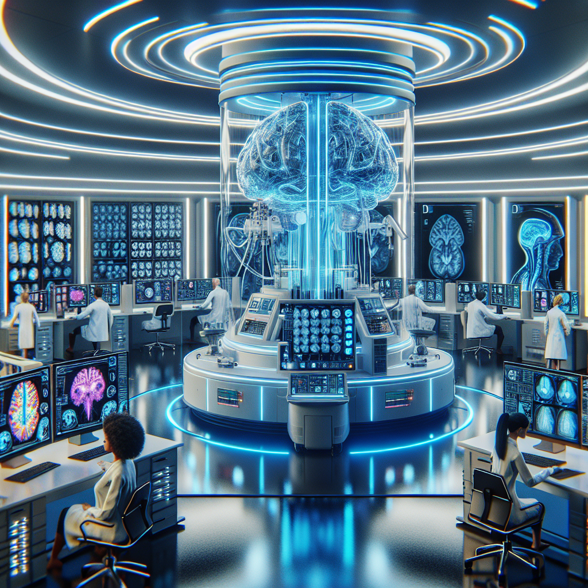

# Creative Image Generation Results

## Original Prompt
"a futuristic looking neuroscience lab"

## Output Folder
`examples/outputs/creative_image_pipeline/futuristic_neuro_lab/`

## Base Image Analysis
This image depicts a highly advanced, futuristic laboratory or research facility with a distinctly science fiction aesthetic. The space is dominated by a large, circular dome ceiling that features intricate metallic paneling radiating outward from a central point, creating a dramatic architectural focal point.

At the center of the room stands an impressive piece of technology - what appears to be a sophisticated brain scanning or neural interface device. This central apparatus features a transparent dome or chamber containing a detailed holographic projection of a human brain, rendered in blue tones with glowing neural pathways and synaptic activity visible as bright points of light. The brain appears to be suspended within the transparent enclosure, surrounded by complex mechanical components and monitoring equipment.

The facility has a clean, sterile appearance with predominantly white and metallic surfaces. Multiple workstations are arranged around the perimeter of the circular room, each equipped with curved monitors displaying various data visualizations, brain scans, and technical readouts. The workstations feature ergonomic white chairs and sleek, modern designs consistent with the high-tech environment.

Several figures in white lab coats can be seen working at different stations, suggesting this is an active research facility. The lighting is sophisticated, with the dome ceiling providing ambient illumination that shifts between cool blues and warm tones, creating an almost ethereal atmosphere.

The overall design suggests this could be a neuroscience research center, brain-computer interface laboratory, or perhaps a facility for advanced cognitive studies - representing the pinnacle of futuristic medical or scientific technology.

## Style Variations Generated
- photorealistic style
- impressionist style
- cyberpunk style

## Enhanced Prompt
- Original: "a futuristic looking neuroscience lab"
- Enhanced: "a futuristic looking neuroscience lab"

## Generated Images

| Image | Description |
|-------|-------------|
|  | Original prompt rendering |
|  | Photorealistic style variation |
|  | Impressionist style variation |
|  | Cyberpunk style variation |
|  | AI-enhanced prompt rendering |

**Total images generated:** 5
