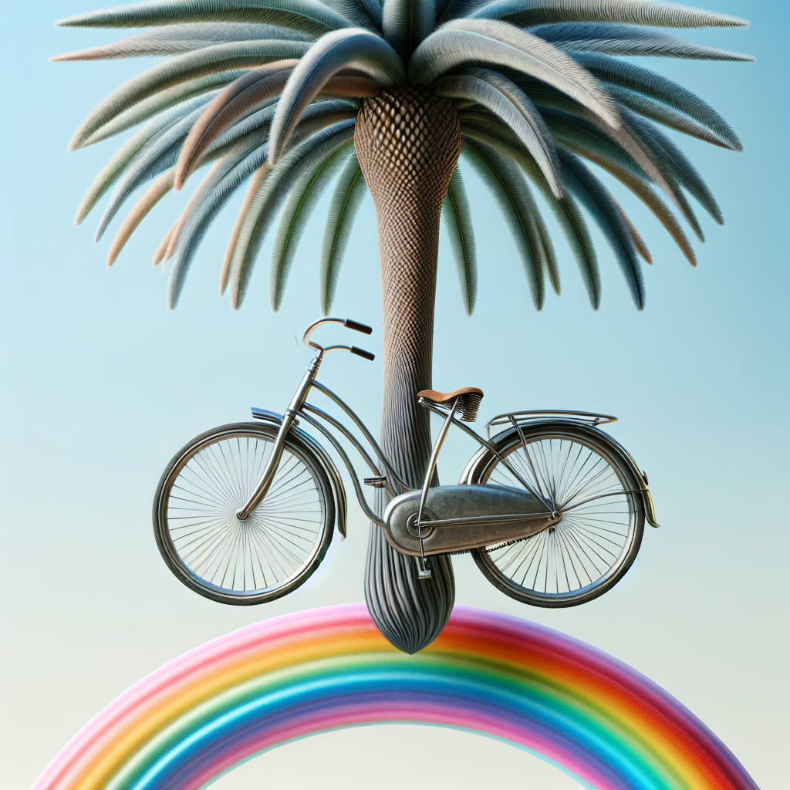
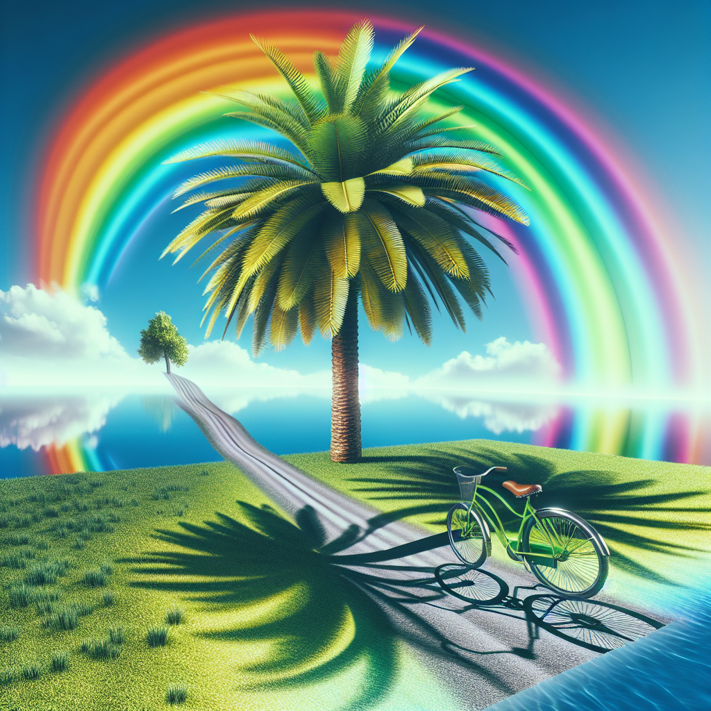
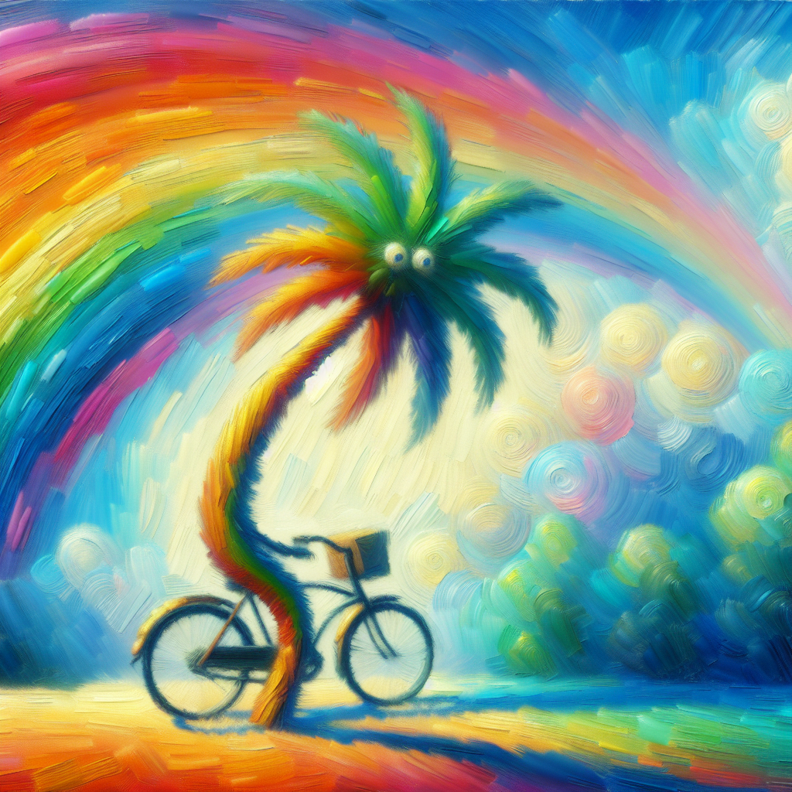
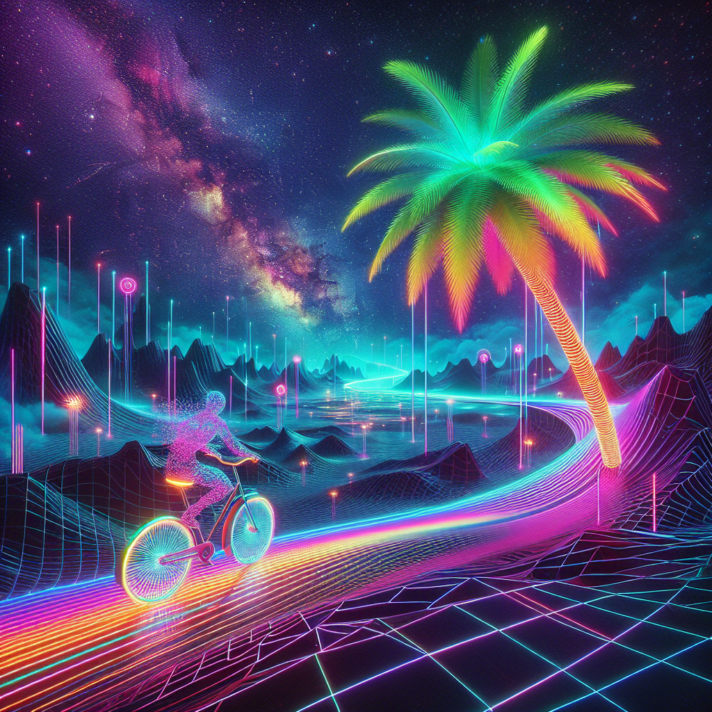
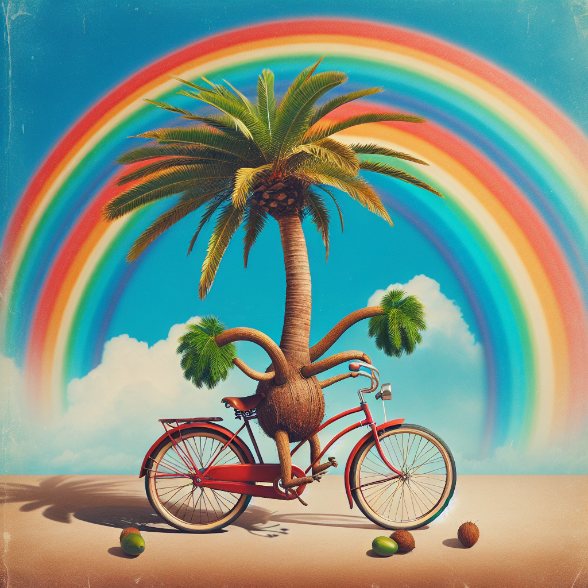

# Creative Image Generation Results

## Original Prompt
"a palm tree riding a bicycle over a rainbow"

## Output Folder
`examples/outputs/creative_image_pipeline/palm_tree_bicycle_rainbow/`

## Base Image Analysis
This is a highly stylized, surreal digital artwork that combines several unexpected elements in a dreamlike composition. The central focus is a metallic palm tree with an elongated, textured trunk that has a distinctive crosshatch or diamond pattern. The trunk appears to be made of polished metal with a bronze or copper finish.

The palm fronds extending from the top are rendered in muted tones of blue-gray and sage green, giving them an almost metallic quality that matches the trunk. These fronds spread outward in a natural palm tree formation but with an artificial, sculptural appearance.

Most surprisingly, there's a vintage-style bicycle positioned as if it's leaning against or somehow integrated with the palm tree trunk. The bicycle appears to be a classic cruiser style with curved handlebars, a comfortable seat, and traditional spoked wheels. It has a silvery-blue metallic finish that complements the palm tree's aesthetic.

At the base of this unusual tree-bicycle hybrid, there's a vibrant rainbow arc that curves across the bottom portion of the image. The rainbow displays the full spectrum of colors in bright, saturated bands.

The background features a soft, gradient sky that transitions from pale blue at the top to a lighter, almost white tone toward the horizon, creating an ethereal, otherworldly atmosphere.

The entire composition has a polished, 3D-rendered quality with careful attention to lighting and reflective surfaces, giving it a contemporary digital art aesthetic that blends tropical imagery with urban transportation in an imaginative, impossible scenario.

## Style Variations Generated
- photorealistic style
- impressionist style
- cyberpunk style

## Enhanced Prompt
- Original: "a palm tree riding a bicycle over a rainbow"
- Enhanced: "a palm tree riding a bicycle over a rainbow"

## Generated Images

| Image | Description |
|-------|-------------|
|  | Original prompt rendering |
|  | Photorealistic style variation |
|  | Impressionist style variation |
|  | Cyberpunk style variation |
|  | AI-enhanced prompt rendering |

**Total images generated:** 5
