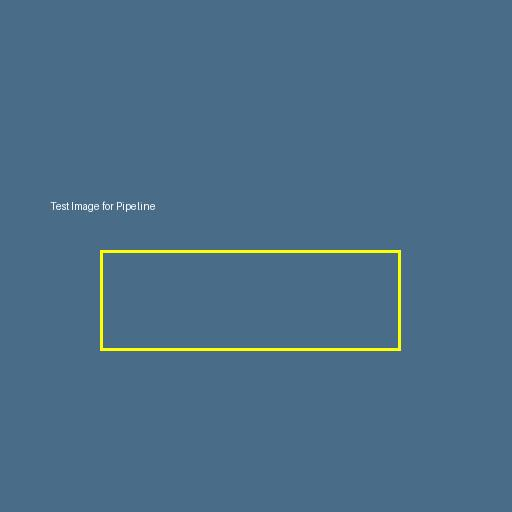
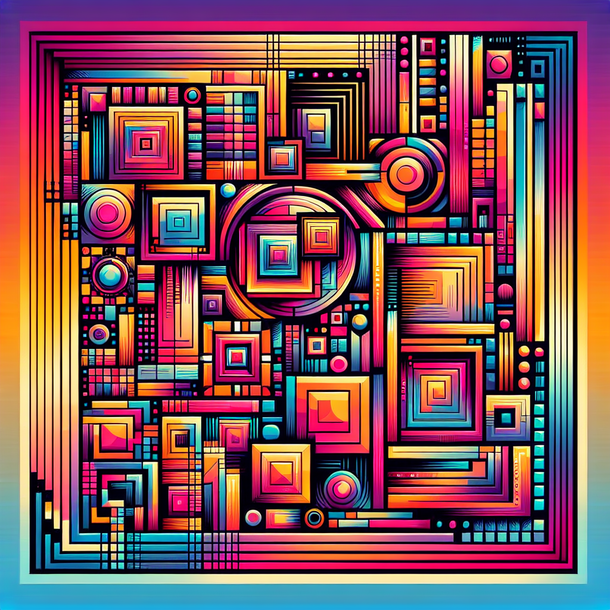
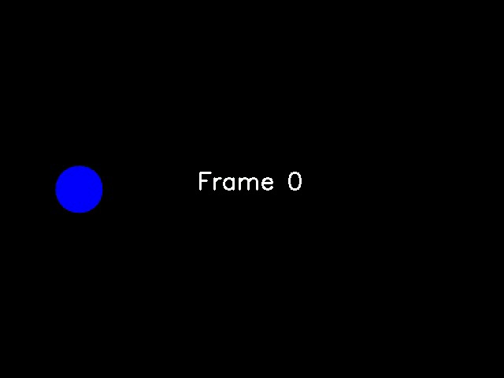
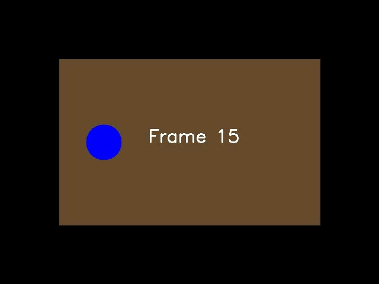
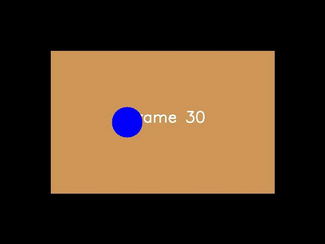
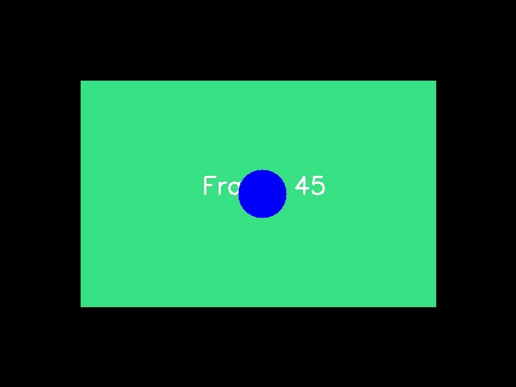
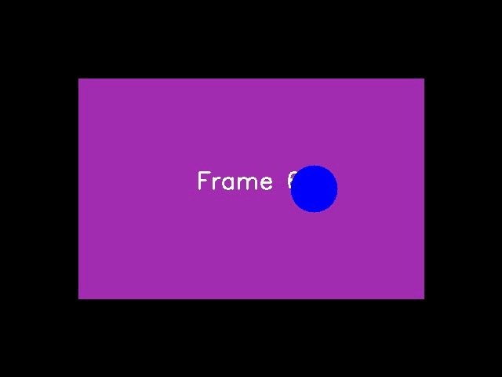
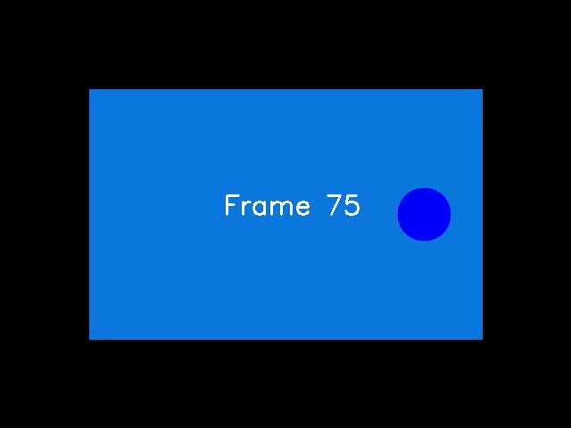

# Multimodal Analysis Results

## 📸 Image Analysis

### Original Image

### Description
- The image is a simple, square graphic with a flat, slate-blue/gray background.
- Near the left side, slightly above the vertical midpoint, there is a short line of small white sans‑serif text that reads: “Test image for Pipeline.”
- Below the text and closer to the lower half of the canvas sits a bright yellow rectangular outline (no fill). The stroke is medium‑thickness and uniform.
- The rectangle is wide and low (landscape orientation), roughly three to four times wider than it is tall. It’s centered horizontally or very close to it, with generous empty space above and below. The interior of the rectangle shows the same blue/gray background.
- There are no photos, textures, shadows, gradients, or other elements—just the single line of text and the outlined rectangle on a solid background. The overall look is that of a minimal placeholder or test graphic.

### Detected Objects
1. **Text**: "Test Image for Pipeline" - Located in the upper left portion of the image, appearing in white text
2. **Rectangle**: A yellow/lime green rectangular outline - Positioned in the center of the image, creating a horizontal rectangular border or frame
3. **Background**: A solid blue-gray background color that fills the entire image

### Generated Variations
Created 3 artistic variations using DALL-E 3:

## 🎵 Audio Analysis

### File Information
- **File**: `samples/test_speech.wav`
- **Format**: wav
- **Duration**: 6.242358276643991 seconds
- **Sample Rate**: 44100 Hz
- **Channels**: 1

### Transcription
> "Hello, this is a test of the audio transcription system. The quick brown fox jumps over the lazy dog."

### Audio Characteristics
- **Volume Level**: normal
- **Noise Level**: high
- **Tempo**: 84.72079918032787 BPM
- **Peak Amplitude**: 0.8288
- **RMS Energy**: 0.1311

### Spectral Analysis
- **Spectral Centroid**: 2636.58 Hz
- **Spectral Rolloff**: 4423.63 Hz  
- **Spectral Bandwidth**: 2164.15 Hz
- **Zero Crossing Rate**: 0.086937

## 🎬 Video Analysis

### Video Information
- **File**: `samples/test_video_real.mp4`
- **Duration**: 3.0 seconds
- **Resolution**: 640x480
- **Frame Rate**: 30.0 FPS
- **Total Frames**: 90

### Content Analysis
Video contains 5 scene changes over 3.0 seconds. Dominant colors include black, mixed. Resolution is 640x480 at 30 fps.

### Scene Detection
- **Total Scene Changes**: 5
- **Scene Change Timestamps**: 0.5, 1.0, 1.5, 2.0, 2.5 seconds
- **Detected Objects**: circle, rectangle, text
- **Dominant Colors**: black, mixed

### Extracted Key Frames

#### Frame at 0.0s

#### Frame at 0.5s  

#### Frame at 1.0s

#### Frame at 1.5s

#### Frame at 2.0s

#### Frame at 2.5s

### Frame Analysis
a simple animation frame against a black background. In the upper left portion of the frame, there is a solid blue circle. The circle appears to be a medium-sized, perfectly round shape with a bright blue color that stands out against the dark background. In the center of the image, there is white text that reads "Frame 0", indicating this is the first frame or starting position of what appears to be an animation sequence. Overall composition: minimalist, with just these two elements - the blue circle and the frame label - visible against the black backdrop.

## 📊 Processing Summary
- **Total Media Files Processed**: 3 (1 image, 1 audio, 1 video)
- **Generated Images**: 3
- **Extracted Video Frames**: 6
- **Processing Time**: Completed successfully

---
*Report generated on 2025-08-21T15:44:14.181460*