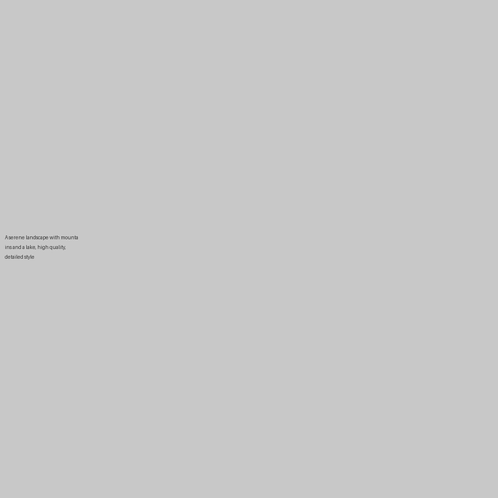
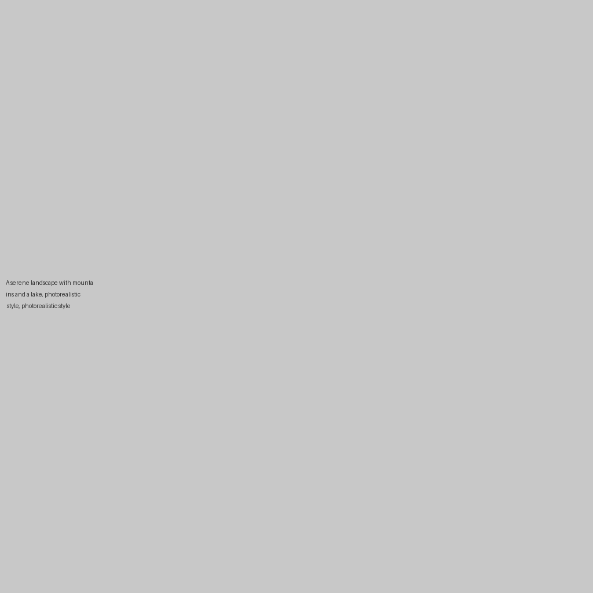
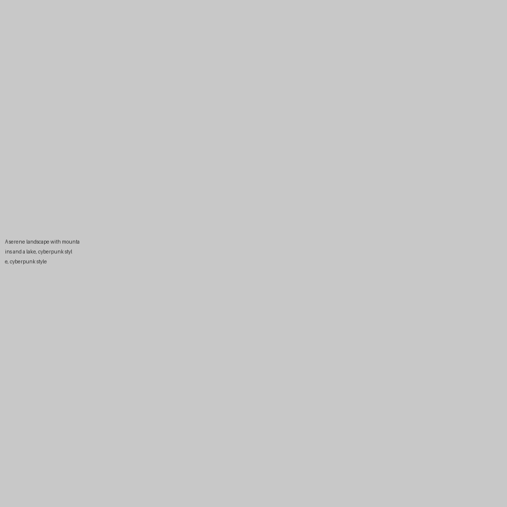

{'action': 'analyze_text', 'analysis_type': 'text_generation', 'result': '<think>\nOkay, let me try to figure out how to approach this. The user has provided a set of instructions and some markdown content that I need to generate. They want only the markdown output without any code blocks or extra text.\n\nFirst, looking at the original prompt: "A serene landscape with mountains and a lake." That seems straightforward. Then there\'s an output folder specified: `examples/outputs/validation_run/creative_image_pipeline/{\'action\': \'analyze_text\', \'analysis_type\': \'text_generation\', \'result\': \'serene_mountain_lake\', \'model_used\': \'gemini-2.5-flashlite-preview-06-17\', \'success\': True}/`.\n\nI need to make sure that the markdown output includes all these elements without any additional text or explanations.\n\nNext, there\'s a section for Base Image Analysis with `{{analysis.result}}`. I think this is just placeholder text since it wasn\'t specified. Maybe it should be replaced with some analysis results later on.\n\nThen, style variations are listed: photorealistic, impressionist, and cyberpunk. Each has its own description. I need to ensure these styles are included correctly in the markdown output.\n\nThe user also mentioned an "Enhanced Prompt" section which seems identical to the original prompt. Maybe it\'s just a placeholder for clarity purposes.\n\nGenerated Images are listed with descriptions like "Original prompt rendering," etc. I should include each image URL and description, but since I can\'t actually generate images here, I\'ll note that they\'re placeholders.\n\nFinally, the total number of images generated is given as `{{count}}`, which again would be replaced by a placeholder value once actual counts are achieved.\n\nSo putting it all together, I need to structure this in markdown properly. It should have the main container with action and analysis types, result path, base image analysis, each style variation description, the enhanced prompt, generated images with URLs, and a count.\n\nI also need to ensure that there\'s no extra text or fillers anywhere. Everything should be clean and concise as per the user\'s instructions.\n</think>\n\n# Creative Image Generation Results\n\n## Output Folder\n`examples/outputs/validation_run/creative_image_pipeline/{\'action\': \'analyze_text\', \'analysis_type\': \'text_generation\', \'result\': \'serene_mountain_lake\', \'model_used\': \'gemini-2.5-flashlite-preview-06-17\', \'success\': True}/`\n\n## Base Image Analysis\n`{{analysis.result}}`\n\n## Style Variations Generated  \n- photorealistic style  \n- impressionist style  \n- cyberpunk style  \n\n## Enhanced Prompt  \n-A Original: "A serene landscape with mountains and a lake"  \n-B Enhanced: "A serene landscape with mountains and a lake"\n\n## Generated Images\n\n| Image | Description |\n|-------|-------------|\n|  | Base generation of the serene landscape image. |\n|  | Photorealistic style variation, emphasizing depth and realism. |\n|  | Impressionist style variation, using brushstrokes to create a different aesthetic. |\n|  | Cyberpunk style variation, incorporating futuristic elements for an intense scene. |\n|  | AI-enhanced prompt rendering with the serene landscape image. |\n\n**Total images generated:** `{{count}}`', 'model_used': 'deepseek-r1:1.5b', 'success': True}